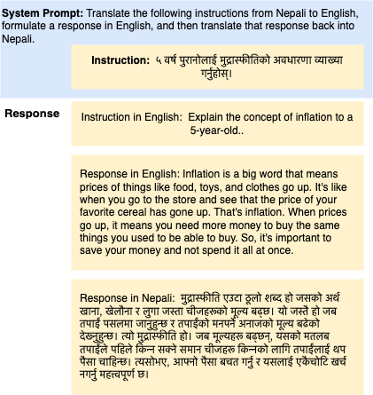

## 🌮 TaCo: Translation-Assisted Cross Linguality method for Efficient Multilingual LLMs

Motivated by the theory of parameter-efficient fine-tuning using LoRA and the Chain of Thought (Wei 2022) process, we propose a new method called TaCo. This method uses translation in the Chain of Thought process to create a multilingual model. In this work, we have used the Chain of Thought process to teach language models to translate the instruction to English first, generate the required response in English, and then translate it back to low-resource languages. For training, we employed the curriculum learning strategy. This strategy utilizes the fine-tuned Guanaco-33B model first and then applies instruction tuning using the TaCo method.

**Datasets:** 
We first translated the Alpaca-52K-GPT4 and Dolly-15K datasets using Google Cloud Translation, translating the data into  132 languages. However, due to computation limits, our experiment continued with three low-resource languages: Sanskrit, Nepali, and Maithili, as well as one high-resource language, Persian.

The datasets can be downloaded from HuggingFace : [saillab/taco-datasets ](https://huggingface.co/datasets/saillab/taco-datasets)

 As machine learning translations are prone to translationese, we performed an evaluation of the translation quality. Initially, we sampled 1000 sentences from each language and calculated the BLEU score using ScarceBLEU , ChrF  , and the Translation Error Rate (TER)  through a round-trip process from English to the target language (en-xx) and back from the target to English (xx-en). We provide the evaluation metric scores for these three low-resource languages:

| Language | BLEU | CHRF++ | TER |
| --- | --- | --- | --- |
| Sanskrit | 65.23 | 84.62 | 19.43 |
| Nepali | 69.68 | 87.37 | 15.02 |
| Persian | 62.42 | 80.72 | 20.61 |
| Maithili | 63.65 | 84.88 | 19.58 |

**Model Response**
You can find the response generated by the trained model [here](https://github.com/UNHSAILLab/TaCo/tree/main/model_generated_response)



**Model Weights**
We have released all of our model adapters in the HuggingFace. 
* [Taco Nepali-33B 🌮](https://huggingface.co/saillab/taco-nepali-33b)
* [Taco Sanskrit-33B 🌮](https://huggingface.co/saillab/taco-sanskrit-33b)
* [Taco Maithili-33B 🌮](https://huggingface.co/saillab/taco-maithili-33b)
* [Taco Persian-33B 🌮](https://huggingface.co/saillab/taco-persian-33b)

**Results**
Performance of different categories across languages can be seen in the below table. 

| Category | Nepali | Sanskrit | Persian | Maithili |
| --- | --- | --- | --- | --- |
| coding | 3.14 | 6.86 | 7.90 | 7.86 |
| common sense | 8.55 | 8.30 | 8.60 | 7.80 |
| counterfactual | 8.90 | 8.30 | 8.46 | 8.30 |
| fermi | 7.70 | 7.70 | 8.20 | 7.50 |
| generic | 9.00 | 9.13 | 9.00 | 9.30 |
| knowledge | 9.55 | 9.42 | 9.25 | 8.80 |
| math | 9.67 | 3.33 | 6.33 | 7.00 |
| roleplay | 8.35 | 8.90 | 8.60 | 7.80 |
| writing | 8.80 | 8.95 | 8.65 | 9.30 |
| Overall average | 8.24 | 8.31 | 8.52 | 8.30 |

**Citation**
Please use the below citation to cite our work.
```
@article{upadhayay2023taco,
  title={TaCo: Enhancing Cross-Lingual Transfer for Low-Resource Languages in LLMs through Translation-Assisted Chain-of-Thought Processes},
  author={Upadhayay, Bibek and Behzadan, Vahid},
  journal={arXiv preprint arXiv:2311.10797},
  year={2023}
}
```
**License and Intended Use**
The TaCo adapter weights are trained on top of the Guanaco-33B (timdettmers/guanaco-33b-merged) model, which is based on the LLaMA model. We used the Alpaca-52K and Dolly-15K datasets and translated them using Google Cloud Translate. We advise you to look into the licensing of Guanaco-33B and the LLaMA model, as well as the terms of usage for Google Cloud Translation, before using this model.
